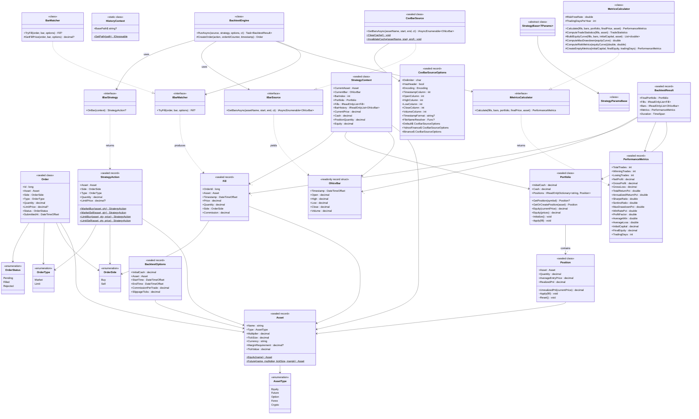

# Domain Model

```mermaid
classDiagram
    direction TB

    %% ── Trading Domain ──────────────────────────────────────────

    class AssetType {
        <<enumeration>>
        Equity
        Future
        Option
        Forex
        Crypto
    }

    class Asset {
        <<sealed record>>
        +Name : string
        +Type : AssetType
        +Multiplier : decimal
        +TickSize : decimal
        +Currency : string
        +MarginRequirement : decimal?
        +TickValue : decimal
        +Equity(name) Asset$
        +Future(name, multiplier, tickSize, margin) Asset$
    }

    class OrderSide {
        <<enumeration>>
        Buy
        Sell
    }

    class OrderStatus {
        <<enumeration>>
        Pending
        Filled
        Rejected
    }

    class OrderType {
        <<enumeration>>
        Market
        Limit
    }

    class Order {
        <<sealed class>>
        +Id : long
        +Asset : Asset
        +Side : OrderSide
        +Type : OrderType
        +Quantity : decimal
        +LimitPrice : decimal?
        +Status : OrderStatus
        +SubmittedAt : DateTimeOffset
    }

    class Fill {
        <<sealed record>>
        +OrderId : long
        +Asset : Asset
        +Timestamp : DateTimeOffset
        +Price : decimal
        +Quantity : decimal
        +Side : OrderSide
        +Commission : decimal
    }

    class Position {
        <<sealed class>>
        +Asset : Asset
        +Quantity : decimal
        +AverageEntryPrice : decimal
        +RealizedPnl : decimal
        +UnrealizedPnl(currentPrice) decimal
        ~Apply(fill) void
        ~Reset() void
    }

    class Portfolio {
        <<sealed class>>
        +InitialCash : decimal
        +Cash : decimal
        +Positions : IReadOnlyDictionary~string, Position~
        +GetPosition(symbol) Position?
        +GetOrCreatePosition(asset) Position
        +Equity(currentPrice) decimal
        +Equity(prices) decimal
        ~Initialize() void
        ~Apply(fill) void
    }

    %% ── History Domain ──────────────────────────────────────────

    class OhlcvBar {
        <<readonly record struct>>
        +Timestamp : DateTimeOffset
        +Open : decimal
        +High : decimal
        +Low : decimal
        +Close : decimal
        +Volume : decimal
    }

    class IBarSource {
        <<interface>>
        +GetBarsAsync(assetName, start, end, ct) IAsyncEnumerable~OhlcvBar~
    }

    class CsvBarSourceOptions {
        <<sealed record>>
        +Delimiter : char
        +HasHeader : bool
        +Encoding : Encoding
        +TimestampColumn : int
        +OpenColumn : int
        +HighColumn : int
        +LowColumn : int
        +CloseColumn : int
        +VolumeColumn : int
        +TimestampFormat : string?
        +FileNameResolver : Func?
        +Default$ CsvBarSourceOptions
        +YahooFinance$ CsvBarSourceOptions
        +Binance$ CsvBarSourceOptions
    }

    class CsvBarSource {
        <<sealed class>>
        +GetBarsAsync(assetName, start, end, ct) IAsyncEnumerable~OhlcvBar~
        +ClearCache()$ void
        +InvalidateCache(assetName, start, end)$ void
    }

    class HistoryContext {
        <<static class>>
        +BasePath$ string?
        +SetPath(path)$ IDisposable
    }

    %% ── Strategy Domain ─────────────────────────────────────────

    class IBarStrategy {
        <<interface>>
        +OnBar(context) StrategyAction?
    }

    class StrategyAction {
        <<sealed record>>
        +Asset : Asset
        +Side : OrderSide
        +Type : OrderType
        +Quantity : decimal
        +LimitPrice : decimal?
        +MarketBuy(asset, qty) StrategyAction$
        +MarketSell(asset, qty) StrategyAction$
        +LimitBuy(asset, qty, price) StrategyAction$
        +LimitSell(asset, qty, price) StrategyAction$
    }

    class StrategyContext {
        <<sealed class>>
        +CurrentAsset : Asset
        +CurrentBar : OhlcvBar
        +BarIndex : int
        +Portfolio : Portfolio
        +Fills : IReadOnlyList~Fill~
        +BarHistory : IReadOnlyList~OhlcvBar~
        +CurrentPrice : decimal
        +Cash : decimal
        +PositionQuantity : decimal
        +Equity : decimal
    }

    class StrategyParamsBase {
        <<class>>
    }

    class StrategyBase~TParams~ {
        <<abstract class>>
    }

    %% ── Reporting Domain ────────────────────────────────────────

    class PerformanceMetrics {
        <<sealed record>>
        +TotalTrades : int
        +WinningTrades : int
        +LosingTrades : int
        +NetProfit : decimal
        +GrossProfit : decimal
        +GrossLoss : decimal
        +TotalReturnPct : double
        +AnnualizedReturnPct : double
        +SharpeRatio : double
        +SortinoRatio : double
        +MaxDrawdownPct : double
        +WinRatePct : double
        +ProfitFactor : double
        +AverageWin : double
        +AverageLoss : double
        +InitialCapital : decimal
        +FinalEquity : decimal
        +TradingDays : int
    }

    class IMetricsCalculator {
        <<interface>>
        +Calculate(fills, bars, portfolio, finalPrice, asset) PerformanceMetrics
    }

    class MetricsCalculator {
        <<class>>
        #RiskFreeRate : double
        #TradingDaysPerYear : int
        +Calculate(fills, bars, portfolio, finalPrice, asset) PerformanceMetrics
        #ComputeTradeStatistics(fills, asset) TradeStatistics
        #BuildEquityCurve(fills, bars, initialCapital, asset) List~double~
        #ComputeMaxDrawdown(equityCurve) double
        #ComputeRiskMetrics(equityCurve) (double, double)
        #CreateEmptyMetrics(initialCapital, finalEquity, tradingDays) PerformanceMetrics
    }

    %% ── Engine Domain ───────────────────────────────────────────

    class BacktestOptions {
        <<sealed record>>
        +InitialCash : decimal
        +Asset : Asset
        +StartTime : DateTimeOffset
        +EndTime : DateTimeOffset
        +CommissionPerTrade : decimal
        +SlippageTicks : decimal
    }

    class IBarMatcher {
        <<interface>>
        +TryFill(order, bar, options) Fill?
    }

    class BarMatcher {
        <<class>>
        +TryFill(order, bar, options) Fill?
        #GetFillPrice(order, bar, options) decimal?
    }

    class BacktestEngine {
        <<class>>
        +RunAsync(source, strategy, options, ct) Task~BacktestResult~
        #CreateOrder(action, orderIdCounter, timestamp) Order
    }

    class BacktestResult {
        <<sealed record>>
        +FinalPortfolio : Portfolio
        +Fills : IReadOnlyList~Fill~
        +Bars : IReadOnlyList~OhlcvBar~
        +Metrics : PerformanceMetrics
        +Duration : TimeSpan
    }

    %% ── Relationships ───────────────────────────────────────────

    %% Trading
    Asset --> AssetType
    Order --> Asset
    Order --> OrderSide
    Order --> OrderType
    Order --> OrderStatus
    Fill --> Asset
    Fill --> OrderSide
    Position --> Asset
    Portfolio --> "*" Position : contains

    %% History
    IBarSource ..> OhlcvBar : yields
    CsvBarSource ..|> IBarSource
    CsvBarSource --> CsvBarSourceOptions

    %% Strategy
    StrategyAction --> Asset
    StrategyAction --> OrderSide
    StrategyAction --> OrderType
    IBarStrategy ..> StrategyAction : returns
    StrategyContext --> Asset
    StrategyContext --> OhlcvBar
    StrategyContext --> Portfolio
    StrategyContext --> "*" Fill
    StrategyBase~TParams~ --> StrategyParamsBase

    %% Reporting
    MetricsCalculator ..|> IMetricsCalculator
    IMetricsCalculator ..> PerformanceMetrics : returns

    %% Engine
    BacktestOptions --> Asset
    BarMatcher ..|> IBarMatcher
    IBarMatcher ..> Fill : produces
    BacktestEngine --> IBarMatcher
    BacktestEngine --> IMetricsCalculator
    BacktestEngine --> IBarSource : uses
    BacktestEngine --> IBarStrategy : uses
    BacktestResult --> Portfolio
    BacktestResult --> PerformanceMetrics
    BacktestResult --> "*" Fill
    BacktestResult --> "*" OhlcvBar
```
