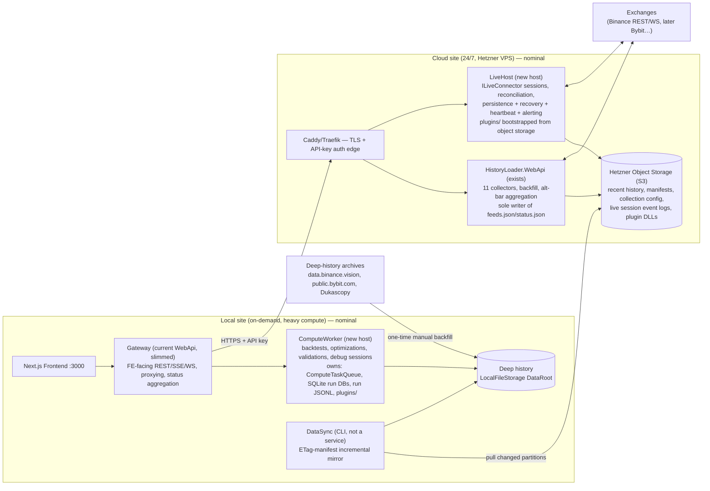

# AlgoTradeForge — Service Decomposition Vision & Milestone Roadmap

## Context

The goal (per `data-flows.png`) is to split AlgoTradeForge so that 24/7 concerns — incremental market-data collection and live strategy hosting — can run on remote servers (Hetzner), while heavy on-demand compute (backtest/optimization/validation) runs locally against deep history. The cloud/local labels are **nominal**: every service must be hostable anywhere via configuration. The work happens in the existing monorepo as multiple services. The system is pre-production; milestone ordering is driven by engineering convenience, not user impact.

Owner decisions baked into this vision:
- **Control plane:** plain HTTP push + status polling. **No VPN** — instead, build an auth mechanism first (API keys now, growable into SaaS auth later). Only local→cloud calls are needed; the cloud never calls into the local site.
- **No Redis** — if/when a cache/stream server is earned, use the free replacement (**Valkey**, or Microsoft **Garnet**); both are Redis-protocol-compatible so `IDistributedCache` still slots in.
- **Live reporting/persistence storage: deferred decision** — interim design must not lock anything in; weigh horizontal-scaling potential and lightweight DBs before committing.
- **Gateway stays local for now**; the cloud part is used privately (host strategies + receive un-backfillable incremental feeds). Revisit placement later.

## What exploration established (key enablers)

- `IFileStorage` (`src/AlgoTradeForge.Storage.Abstractions/IO/IFileStorage.cs`) already abstracts the data plane: `LocalFileStorage` + `S3FileStorage` (Hetzner Object Storage default endpoint), atomic writes, ETag CAS (`ReadWithEtag`/`WriteIfMatch`). The backtest read path (`BacktestPreparer → HistoryRepository → PartitionedCsvBarLoader/CsvFeedSeriesLoader`) is backend-agnostic already.
- `AlgoTradeForge.HistoryLoader.WebApi` is already a separate service (11 collectors, aggregation worker, catalog/status/backfill API at :5050); the main WebApi already proxies to it over HTTP+SSE (`DataEndpoints.cs`) — the gateway pattern has a precedent.
- `BinanceLiveConnector` is production-complete (WS kline + user-data streams, REST orders, per-session event queue, 3-phase reconciliation) but runs **in-process** in the WebApi with in-memory session stores — no persistence, no restart recovery, no alerting.
- Compute (`ComputeQueueConsumer` + executors + `ComputeTaskQueue` channel) runs in-process in the WebApi. `RunProgressCache` is on `IDistributedCache` (in-memory, swappable).
- Strategies are engine-agnostic (`IOrderContextReceiver` gets `BacktestOrderContext` OR `LiveOrderContext`) — the same plugin DLL can run in backtest and live hosts.
- No sync/replication between local and S3 stores exists yet. `feeds.json`/`status.json` manifests live with the data, CAS-protected.

## 1. Target service topology



**Four hosts, one CLI tool, no more.** Boundaries follow lifecycle and failure domain, not domain purity:

| Service | Lifecycle / failure domain | Owns | Moves out of current WebApi |
|---|---|---|---|
| **Gateway** (WebApi renamed, M5) | stable FE contract, restart-anytime | nothing (config + proxy clients) | everything below; keeps endpoint contracts, JSON policy, CORS |
| **ComputeWorker** (new) | restarted 20×/day during dev, CPU-bound | `ComputeTaskQueue`, executors, SQLite run/validation/threshold DBs, run JSONL folders, simulation cache, `RunProgressCache`, cancellation registry, `plugins/` | `ComputeQueueConsumer`, 3 task executors, engine wiring, debug WS handler, plugin loading |
| **LiveHost** (new) | runs for months untouched, holds money + secrets | live session store (storage TBD, see §6 Q6), session JSONL event logs → S3, `plugins/`, exchange keys | `LiveEndpoints`, `BinanceLiveConnector`/`AccountManager`, `InMemoryLiveSessionStore` (replaced) |
| **HistoryLoader.WebApi** (exists) | IO-bound 24/7, redeploy must never touch positions | market data partitions, `feeds.json` (sole writer), `status.json`, aggregation cursors | — (gains: remote-friendly config, incremental alt-bars) |
| **DataSync** (CLI) | run-on-demand / scheduled, idempotent | `sync-state.json` manifest per mirrored prefix | — (new) |

Why LiveHost ≠ HistoryLoader even though both are 24/7 cloud: different failure domains — a collector redeploy must never touch open positions; the live host holds secrets and money, the collector neither. They share the VPS, not the process.

## 2. Data plane

Two tiers, one abstraction — `IFileStorage` everywhere:

- **Recent history (cloud):** Hetzner Object Storage via `S3FileStorage`. Writer: HistoryLoader. Contents: rolling partitions, ticks, manifests, collection config, live event logs, plugin DLLs.
- **Deep history (local):** workstation disk via `LocalFileStorage`. Writers: DataSync (pull) + manual deep-backfill imports (data.binance.vision etc.).

**Sync (DataSync CLI):** the buffer-then-PUT writer model means partitions are only ever replaced whole, so **object ETag equality ⇔ content equality**. DataSync keeps `sync-state.json` (`key → {etag, size}`) per prefix; each run = one `ListObjectsV2` (ETags come free) → diff → download changed keys → atomic local publish → update manifest. Closed months never change, so steady state transfers only the current-month partitions + recent ticks + manifests. The mutable current-month partition is exactly what the manifest approach handles natively. Pull cloud→local by default; optional push local→cloud for deep backfills and plugin DLL publishing. No deletion mirroring by default (`--prune` opt-in).

**Manifest ownership:** `feeds.json`/`status.json` written exclusively by HistoryLoader against its primary backend via existing CAS. Local mirror copies are read-only replicas. Never two writers per backend.

## 3. Control plane

**HTTP push + status polling, local→cloud only, authenticated.** No VPN, no MQ.

- Gateway (local) → ComputeWorker (local): `POST /tasks`, proxy status/progress/cancel/debug-WS. The `ComputeTaskQueue` channel stays in-process inside the worker — enqueue just moves from an in-process call to an HTTP call. A down worker = immediate honest 503, not an invisibly growing queue.
- Gateway (local) → LiveHost / HistoryLoader (cloud): HTTPS through Caddy with API-key auth. Live session commands (start/stop) are synchronous HTTP — they are not queue-shaped.
- **Auth (early, cross-cutting):** shared API-key middleware library used by every internet-exposed host. Keys in env/secret files. Designed so the principal model can later grow into SaaS users/tokens without changing call sites (auth header contract stable).
- **Progress:** each service exposes its own `GET .../progress`; gateway proxies. Upgrade seam already exists: `RunProgressCache` is on `IDistributedCache` — if cross-host progress fan-out ever chafes, stand up **Valkey/Garnet** on the VPS and repoint both sides (config + one DI registration). Same story for a future multi-worker queue (Streams + consumer groups). Do not build speculatively.

## 4. Monorepo layout

```
src/
  # shared kernel (unchanged)
  AlgoTradeForge.Domain/  Application/  Infrastructure/
  AlgoTradeForge.Storage.Abstractions/  AlgoTradeForge.Storage/
  # new shared libs
  AlgoTradeForge.ServiceClients/      # typed HttpClients (ComputeWorkerClient, LiveHostClient,
                                      #   move HistoryLoaderClient here) + shared wire DTOs
  AlgoTradeForge.ServiceAuth/         # API-key middleware + client auth handler (small)
  # hosts
  AlgoTradeForge.Gateway/             # current WebApi, renamed at M5 (delete stale bin/obj-only
                                      #   Gateway/ and CandleIngestor/ folders first)
  AlgoTradeForge.ComputeWorker/       # new
  AlgoTradeForge.LiveHost/            # new
  AlgoTradeForge.HistoryLoader.*/     # existing 4 projects, unchanged
  # tooling
  AlgoTradeForge.DataSync/            # new CLI
deploy/
  docker-compose.cloud.yml            # caddy + historyloader + livehost (+ valkey later)
  docker-compose.local.yml            # computeworker (+ optional local historyloader for offline dev)
  .env.cloud.example  .env.local.example  hetzner.md
```

Rules:
- **Hosts contain only `Program.cs`, endpoints, host-specific BackgroundServices, appsettings.** All logic stays in the shared kernel — that's what keeps 4 hosts cheap for one developer. Don't split `AlgoTradeForge.Infrastructure` per host; composition roots select what's active (HistoryLoader already proves this pattern).
- **Plugins into both ComputeWorker and LiveHost:** `PluginLoader.LoadFrom(Plugins:Paths)` is path-configurable. Locally, the private repo's post-build copies to both hosts' `plugins/`. For the VPS, publish DLLs to an object-store prefix (`plugins/{name}/{version}/`) via DataSync push; LiveHost downloads its **pinned** version at startup before `PluginLoader` runs. Record plugin version per live session so a session is never silently resumed under a different strategy build.
- **Contracts discipline:** gateway proxies must not re-model DTOs; `ServiceClients` is the single wire-type home.

## 5. Milestone roadmap (ordered by engineering convenience)

Each independently shippable; the frontend never breaks.

**M0 — Monorepo prep + auth foundation** (small)
Delete stale empty `Gateway/`/`CandleIngestor/` folders; create `ServiceClients` (move `HistoryLoaderClient` + promote shared DTOs) and `ServiceAuth` (API-key middleware + delegating handler); `deploy/` skeleton with compose files and env examples.
*Exit:* solution builds with new projects; HistoryLoader proxying goes through `ServiceClients`; API-key middleware demonstrably guards HistoryLoader endpoints when enabled by config.

**M1 — 24/7 collection in the cloud** (mostly ops)
HistoryLoader on Hetzner VPS behind Caddy (TLS + API key), `Storage:Backend=S3`. Replace `ISettingsWriter` appsettings-writeback with CAS-protected `config/collection.json` on `IFileStorage` + `GET/PUT /api/v1/config` (containers must be config-immutable; discovered `historyStart` lands there or in `feeds.json`). Liveness alerting (uptime-kuma / healthchecks.io).
*Exit:* 7 days unattended collection; `status.json` green; redeploy loses no closed partition; collection config editable without touching the image.

**M2 — DataSync CLI**
ETag-manifest incremental pull (§2), per-prefix include rules, `--dry-run`, scheduled via Task Scheduler.
*Exit:* steady-state sync transfers only changed keys (verified by manifest diff count); a backtest spanning deep-local + freshly-synced data is gap-free.

**M3 — LiveHost extraction + durability** (the big one; two shippable sub-phases)
*M3a:* new LiveHost host; move live DI wiring + `LiveEndpoints` out of WebApi; gateway proxies `/live/*` via `LiveHostClient`; plugin loading; run locally first.
*M3b:* session persistence (storage decision made here — see §6 Q6) replacing `InMemoryLiveSessionStore`; boot-time session recovery replaying the existing 3-phase reconciliation against exchange state; heartbeat endpoint + staleness watchdog; Telegram/webhook alerting; plugin bootstrap-from-S3 with version pinning; deploy to VPS.
*Exit:* kill -9 mid-session with an open position → restart resumes the session, position/orders reconciled, alert sent; one small strategy live on the VPS 14 days unattended.

**M4 — ComputeWorker extraction**
Move `ComputeQueueConsumer`, executors, engine wiring, plugin loading, SQLite run/validation repos, simulation cache, debug WS handler into the new host; gateway dispatches `POST /tasks` + proxies status/progress/reports/debug-WS; `ComputeWorker:BaseUrl` config (localhost default).
*Exit:* all FE flows unchanged via gateway with worker as separate process; queue behavior (single consumer, cancellation, progress) identical.

**M5 — Gateway slimming**
Rename WebApi → `AlgoTradeForge.Gateway`; delete in-process engine/queue/live remnants; gateway stays local (cloud used privately); revisit placement later — gateway is stateless so moving it is config.
*Exit:* gateway has no project reference to engine internals beyond contracts; all hosts start from compose/CLI with placement chosen purely by env.

**M6 — Live alt-bars + reporting polish**
Promote `IBarAccumulator` + accumulators out of `internal` in `HistoryLoader.Application/Aggregation/Accumulators/` into a shared project; incremental aggregation BackgroundService in HistoryLoader (persisted cursor + partial-bar state, CAS JSON next to the feed); in-process live bar building in LiveHost from its own stream using the same accumulators, seeded from the historical alt-bar feed; golden test incremental ≡ batch. Live dashboards.
*Exit:* a live strategy consumes equal-volume bars whose historical record matches the live-computed sequence exactly over an overlap window; golden test green.

## 6. Answers to the six open questions (from data-flows.png)

**Q1 — Feeds metadata: db or file?** **File.** Keep `feeds.json` per asset on `IFileStorage` — already CAS-protected, travels with the data under sync (a DB would need its own replication and lets metadata/data diverge), backend-agnostic, human-inspectable. Revisit only for cross-asset relational queries or multi-writer needs.

**Q2 — Where to configure live data feeds to collect?** Move the `Assets`/`Feeds` tree from `appsettings.json` into **`config/collection.json` on the same `IFileStorage` backend as the data**, CAS-protected, exposed via `GET/PUT /api/v1/config` (FE page later). appsettings-writeback is incompatible with immutable containers/remote hosts; the storage backend is the durable, synced, CAS-capable place; DataSync mirrors the config for free. `appsettings.json` keeps infra-only settings (URLs, rate budgets, flush tuning).

**Q3 — Deep history availability:** **Binance** `data.binance.vision` — free daily/monthly ZIPs: spot klines/trades/aggTrades from 2017, USDⓈ-M futures from ~2019-09, futures metrics (OI/ratios ~2021-12+), fundingRate, bookTicker/bookDepth (limited ranges). Build the backfill importer against this first. **Bybit** `public.bybit.com` — free tick-level trade archives (~2020+) + REST klines. **MT/FX** — no central archive; broker-served, gappy; use **Dukascopy** (free ticks ~2003+) or TrueFX, imported via converter into the same partition format rather than live-collected.

**Q4 — Live equal-metric bar detection?** One fold, two cadences. *Canonical record:* incremental aggregation service in HistoryLoader tails new source rows and feeds the **same** `IBarAccumulator` implementations as the batch pipeline, persisting `{cursor, partial-bar state}` as CAS JSON; completed bars append via `BufferedPartitionWriter`; batch builder kept for rebuilds; golden test asserts incremental ≡ batch. *Signal timing:* LiveHost builds bars in-memory from its own stream with the same shared accumulators (promoted out of `internal`), seeded at session start from the historical feed + persisted partial state. Single fold source guarantees backtest/live parity.

**Q5 — MQs/DBs on Hetzner?** **docker-compose on one VPS.** Caddy/Traefik (TLS) → historyloader + livehost; named volumes; Hetzner Object Storage as S3; `deploy.ps1`/Makefile over SSH for releases; uptime-kuma/healthchecks.io; nightly restic backup to the same object storage. **No MQ initially**; when a cache/stream server is earned it's **Valkey or Garnet** (not Redis) as one more compose service. Terraform (hcloud) optional sugar; a documented `deploy/hetzner.md` suffices at this scale. No k8s.

**Q6 — Storages for live + backtest reporting?**
- *Backtest/optimization/validation:* keep exactly what exists — SQLite + run-folder JSONL on the ComputeWorker's local disk. Single-user, battle-tested.
- *Live:* **decision deferred to M3b** (owner choice). Non-negotiable interim design that avoids lock-in: per-session **JSONL event logs written through the existing `IRunSink`/`JsonlFileSink` machinery and archived to Object Storage** — this is the replayable source of truth, so *any* queryable store can be (re)built from it later. Candidates to evaluate at M3b, weighing horizontal scaling: (a) SQLite per LiveHost + Litestream replication to S3 (lightest, scales by adding hosts since sessions are shard-friendly); (b) libSQL/Turso (SQLite-compatible with replication built in); (c) Postgres (only if multi-user/SaaS becomes real). Recovery state (sessions/orders/fills snapshots) needs only per-host durability, which every candidate satisfies.

## Risks

1. **M3b recovery semantics** (rehydrating sessions against live exchange state) is the only genuinely hard distributed-state problem — isolated in its own sub-phase with a kill-test exit criterion, built on the existing 3-phase reconciliation.
2. **Two writers on `feeds.json`** would corrupt the manifest model — HistoryLoader stays sole writer per backend; CAS failures make violations loud.
3. **Plugin version skew** between compute (what you optimized) and live (what trades) — mitigated by per-session version pinning.
4. **Exposed cloud API without VPN** — mitigated by TLS + API-key auth from M0/M1, secrets in env, and the LiveHost never accepting unauthenticated traffic; auth contract designed to grow into SaaS tokens.

## Critical files

- `src/AlgoTradeForge.WebApi/Program.cs` — composition root to split (queue consumer, live wiring, plugin loading, proxies)
- `src/AlgoTradeForge.Storage.Abstractions/IO/IFileStorage.cs` — data-plane contract (CAS) that DataSync, collection config, live logs build on
- `src/AlgoTradeForge.HistoryLoader.WebApi/appsettings.json` + `AppSettingsWriter.cs` — config to relocate to `collection.json` (M1)
- `src/AlgoTradeForge.WebApi/Endpoints/LiveEndpoints.cs` + `src/AlgoTradeForge.Application/Live/InMemoryLiveSessionStore.cs` — live surface + store replaced in M3
- `src/AlgoTradeForge.HistoryLoader.Application/Aggregation/Accumulators/` — `internal` accumulators to promote for live alt-bar parity (M6)

## Verification

This is an architecture/strategy document, not code. Verification per milestone is in each milestone's exit criteria; the document itself is "done" when the owner signs off on topology, control plane, data plane, and milestone ordering. Each milestone will later get its own spec/plan/tasks decomposition (speckit flow) before implementation.
