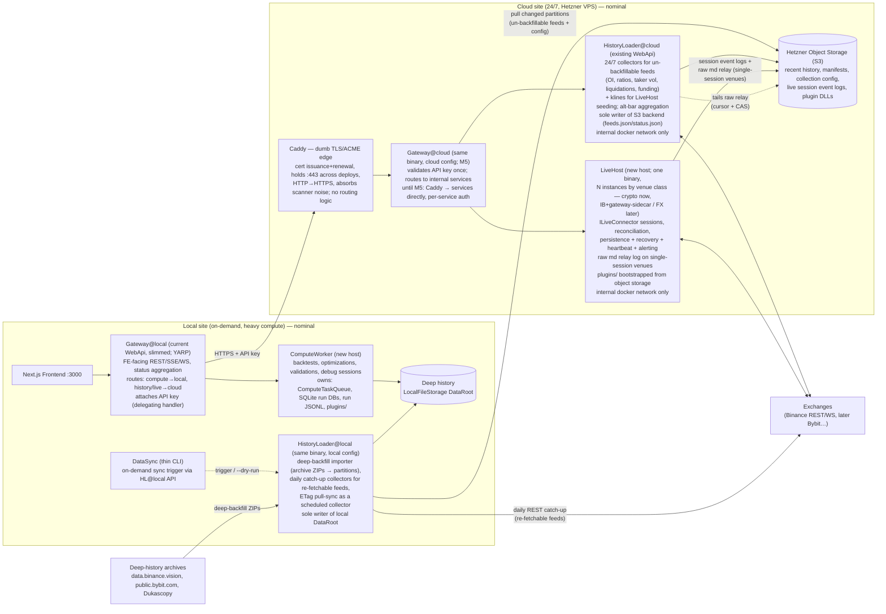

# AlgoTradeForge — Service Decomposition Vision & Milestone Roadmap

## Context

The goal (per `data-flows.png`) is to split AlgoTradeForge so that 24/7 concerns — incremental market-data collection and live strategy hosting — can run on remote servers (Hetzner), while heavy on-demand compute (backtest/optimization/validation) runs locally against deep history. The cloud/local labels are **nominal**: every service must be hostable anywhere via configuration. The work happens in the existing monorepo as multiple services. The system is pre-production; milestone ordering is driven by engineering convenience, not user impact.

Owner decisions baked into this vision:
- **Control plane:** plain HTTP push + status polling. **No VPN** — instead, build an auth mechanism first (API keys now, growable into SaaS auth later). Only local→cloud calls are needed; the cloud never calls into the local site.
- **No Redis** — if/when a cache/stream server is earned, use the free replacement (**Valkey**, or Microsoft **Garnet**); both are Redis-protocol-compatible so `IDistributedCache` still slots in.
- **Live reporting/persistence storage: deferred decision** — interim design must not lock anything in; weigh horizontal-scaling potential and lightweight DBs before committing.
- **Gateway stays local for now**; the cloud part is used privately (host strategies + receive un-backfillable incremental feeds). Revisit placement later.
- **Gateway is a role, not a place:** one YARP-based gateway binary deployed per site with site-specific route config — local instance (FE-facing) today, a second instance lands on the VPS at M5. Migrating a service = moving its cluster destination between the two config files. **Caddy is the cloud edge and stays permanently dumb** (TLS/ACME only); all gateway features — auth, routing, rate limits, transforms — live in C# middleware, never in edge config.
- **HistoryLoader is also a role, not a place:** same binary, two instances, per-site collector config split by **backfillability**. Cloud instance: 24/7 collectors for feeds that cannot be re-fetched later (OI, ratios, taker volume, liquidations, funding as it happens) plus whatever its site needs locally (e.g. klines for LiveHost bar seeding). Local instance: deep-backfill importer + scheduled daily catch-up of re-fetchable feeds (klines via REST) + the S3 pull-sync running as one more scheduled collector. **Sole-writer-per-backend is held per instance:** HistoryLoader@cloud is the only writer of the S3 backend, HistoryLoader@local the only writer of the local DataRoot — including synced copies, since sync runs inside it. Exception: LiveHost-owned raw relay prefixes (see §2), which carry raw events only, never canonical partitions or manifests.
- **Exchange connectivity is capability-driven, not uniform (Q7 resolved):** on venues with cheap concurrent access (crypto), LiveHost and HistoryLoader connect independently. On single-session venues (Interactive Brokers, MT/dealer FIX — one login per account, market data and orders share the session), LiveHost owns the session and relays raw market events through an append-only JSONL log on `IFileStorage`; HistoryLoader tails it as one more collector. **No broker, no connection proxy** — see §6 Q7 for rationale and the relay contract.
- **LiveHost is also a role, not a place:** one binary, N instances partitioned by venue class via config — `LiveHost@crypto` (Binance/Bybit) now; `LiveHost@ib` (with its IB Gateway sidecar) or `LiveHost@fx` later, when those connectors exist. Blast-radius isolation (a crypto connector bug never restarts an IB session) and free placement per venue (latency/region). Build the second instance when the second venue class arrives, not before.
- **IaC + CI/CD from day one (§0):** Terraform (hcloud) in a separate **private infra repo (does not exist yet — created at M1)**; GitHub Actions in the app repo builds, tests, publishes per-host images to GHCR, and deploys over SSH — automatically for stateless/recoverable services, manually gated for LiveHost. No k8s (Q5 stands); docker-compose remains the runtime.

## 0. Repositories, IaC & CI/CD

**Seam rule:** anything that changes when the *code* changes lives in the app repo; anything that changes when the *infrastructure* changes lives in the private IaC repo.

| Layer | Lives in | Changes when |
|---|---|---|
| Dockerfiles (one per host), all compose files (incl. cloud), config profiles, Caddyfile | app repo `deploy/` + `src/*/Dockerfile` | code/topology changes |
| Servers, firewall, DNS, bucket, cloud-init | IaC repo (private, to be created) | infrastructure changes |
| Secrets | VPS `.env` + GitHub Actions secrets | rotation only |
| Collection/runtime config | `collection.json` on `IFileStorage` | operationally, via API |

The cloud compose file deliberately lives in the **app** repo: when a milestone adds a container (gateway at M5), the same PR adds code + compose entry. The IaC repo must never need a commit because the service topology evolved.

**Config profiles:** one dimension, one env var — `ATF_PROFILE` — selects `appsettings.{profile}.json`, loaded explicitly in `Program.cs`. It unifies the three role-not-place axes: site for gateway/HistoryLoader (`local` | `cloud`), venue class for LiveHost (`binance` | `ib` | …). `DOTNET_ENVIRONMENT` keeps its stock meaning (Development/Production logging, exception pages) and is not overloaded. Do not name HistoryLoader's cloud profile "live" — it collides with LiveHost terminology. **Secrets are never in appsettings/profiles** — exchange keys, API keys, S3 credentials arrive as env vars from the server-side `.env` (compose `env_file:`), which exists only on the VPS.

**Private IaC repo scaffold** (e.g. `AlgoTradeForge.Infra`; created at M1):
- Terraform, `hcloud` provider: `hcloud_server` (+ `hcloud_volume` for data), `hcloud_firewall` (443/80 world, SSH from owner IP only), `hcloud_ssh_key`, DNS records (Hetzner DNS or Cloudflare provider), Object Storage bucket + keys via the `aws` provider pointed at Hetzner's S3 endpoint.
- cloud-init: docker + compose plugin, deploy user, key-only SSH.
- State: S3 backend on Hetzner Object Storage (bootstrap the state bucket manually once).
- **Single workspace** — no multi-env machinery until a second environment actually exists.
- Pipeline: `terraform plan` on PR, manual `apply`.

**CI/CD (GitHub Actions, app repo):**
- **CI:** build + tests on PR (sequential `dotnet test` — one process rule).
- **Publish:** on main — per-host images → GHCR, tagged with git SHA (immutable) + `latest`.
- **Deploy:** SSH to VPS, `docker compose pull && docker compose up -d` at the SHA tag. **Two gates:** `historyloader`/`gateway`/`caddy` auto-deploy on main (M1 exit criterion — redeploy loses no closed partition — is what makes this safe); `livehost` requires **manual approval** (GitHub Environment + required reviewer). The money host never redeploys because an unrelated commit landed; no watchtower-style auto-pull for it, ever.
- **Plugins** keep their designed path: the private strategies repo's CI publishes DLLs to `plugins/{name}/{version}/` on object storage; LiveHost pulls its pinned version at startup — a plugin deploy is a version-bump config change, not an image rebuild.

This supersedes Q5's earlier `deploy.ps1`/Makefile-over-SSH idea (the script's logic becomes the deploy job) and promotes Terraform from "optional sugar" to the provisioning path.

## What exploration established (key enablers)

- `IFileStorage` (`src/AlgoTradeForge.Storage.Abstractions/IO/IFileStorage.cs`) already abstracts the data plane: `LocalFileStorage` + `S3FileStorage` (Hetzner Object Storage default endpoint), atomic writes, ETag CAS (`ReadWithEtag`/`WriteIfMatch`). The backtest read path (`BacktestPreparer → HistoryRepository → PartitionedCsvBarLoader/CsvFeedSeriesLoader`) is backend-agnostic already.
- `AlgoTradeForge.HistoryLoader.WebApi` is already a separate service (11 collectors, aggregation worker, catalog/status/backfill API at :5050); the main WebApi already proxies to it over HTTP+SSE (`DataEndpoints.cs`) — the gateway pattern has a precedent.
- `BinanceLiveConnector` is production-complete (WS kline + user-data streams, REST orders, per-session event queue, 3-phase reconciliation) but runs **in-process** in the WebApi with in-memory session stores — no persistence, no restart recovery, no alerting.
- Compute (`ComputeQueueConsumer` + executors + `ComputeTaskQueue` channel) runs in-process in the WebApi. `RunProgressCache` is on `IDistributedCache` (in-memory, swappable).
- Strategies are engine-agnostic (`IOrderContextReceiver` gets `BacktestOrderContext` OR `LiveOrderContext`) — the same plugin DLL can run in backtest and live hosts.
- No sync/replication between local and S3 stores exists yet. `feeds.json`/`status.json` manifests live with the data, CAS-protected.

## 1. Target service topology



**Four host projects, one CLI tool, no more** — the gateway and HistoryLoader each deploy as two instances of the same binary, one per site, differing only in `appsettings.{site}.json`. Boundaries follow lifecycle and failure domain, not domain purity:

| Service | Lifecycle / failure domain | Owns | Moves out of current WebApi |
|---|---|---|---|
| **Gateway** (WebApi renamed, M5; YARP; 2 instances: local FE-facing + cloud behind Caddy) | stable FE contract, restart-anytime | nothing (per-site route config + proxy clients) | everything below; keeps endpoint contracts, JSON policy, CORS |
| **ComputeWorker** (new) | restarted 20×/day during dev, CPU-bound | `ComputeTaskQueue`, executors, SQLite run/validation/threshold DBs, run JSONL folders, simulation cache, `RunProgressCache`, cancellation registry, `plugins/` | `ComputeQueueConsumer`, 3 task executors, engine wiring, debug WS handler, plugin loading |
| **LiveHost** (new; one binary, N instances by venue class — crypto now, IB/FX when those connectors exist) | runs for months untouched, holds money + secrets; per-instance blast radius | live session store (storage TBD, see §6 Q6), session JSONL event logs → S3, raw md relay prefixes (`live-md/{venue}/`, single-session venues only), `plugins/`, exchange keys | `LiveEndpoints`, `BinanceLiveConnector`/`AccountManager`, `InMemoryLiveSessionStore` (replaced) |
| **HistoryLoader.WebApi** (exists; 2 instances: cloud 24/7 un-backfillable + local backfill/catch-up/pull-sync) | cloud: IO-bound 24/7, redeploy must never touch positions; local: run-when-needed | per instance, its site's backend: market data partitions, `feeds.json`/`status.json` (sole writer per backend), aggregation cursors; local instance also owns `sync-state.json` | — (gains: remote-friendly config, incremental alt-bars, pull-sync collector) |
| **DataSync** (thin CLI) | run-on-demand trigger, idempotent | nothing — sync logic + `sync-state.json` live with HistoryLoader@local | — (new, small) |

Why LiveHost ≠ HistoryLoader even though both are 24/7 cloud: different failure domains — a collector redeploy must never touch open positions; the live host holds secrets and money, the collector neither. They share the VPS, not the process. The only cross-host data flow between them is the raw md relay log on single-session venues (§2, Q7) — data-shaped and asynchronous through storage, never a runtime call.

## 2. Data plane

Two tiers, one abstraction — `IFileStorage` everywhere:

- **Recent history (cloud):** Hetzner Object Storage via `S3FileStorage`. Writer: HistoryLoader@cloud (sole). Contents: rolling partitions, ticks, manifests, collection config, live event logs, plugin DLLs.
- **Deep history (local):** workstation disk via `LocalFileStorage`. Writer: HistoryLoader@local (sole) — its deep-backfill importer, daily catch-up collectors, and pull-sync collector are all in one process, so even mirrored data has a single local writer.

**Feed placement rule — backfillability:** feeds that can be re-fetched anytime (klines via REST) are collected per site by that site's instance — a gap from the workstation being off a week self-heals on the next catch-up run. Feeds that cannot be re-fetched (OI, ratios, taker volume, liquidations, funding-as-it-happens) are collected 24/7 by HistoryLoader@cloud only and reach the local backend via pull-sync. Sync include rules therefore cover only un-backfillable feeds + config — never feeds the local instance collects itself.

**Sync (pull-sync collector inside HistoryLoader@local; DataSync is a thin CLI trigger over its API):** the buffer-then-PUT writer model means partitions are only ever replaced whole, so **object ETag equality ⇔ content equality**. The sync collector keeps `sync-state.json` (`key → {etag, size}`) per prefix; each run = one `ListObjectsV2` (ETags come free) → diff → download changed keys → atomic local publish → update manifest. Closed months never change, so steady state transfers only the current-month partitions + recent ticks + manifests. The mutable current-month partition is exactly what the manifest approach handles natively. Pull cloud→local by default; optional push local→cloud for deep backfills and plugin DLL publishing. No deletion mirroring by default (`--prune` opt-in). Scheduling via the instance's own Cronos schedules; `--dry-run` and on-demand runs via the CLI.

**Manifest ownership:** `feeds.json`/`status.json` written exclusively by the owning site's HistoryLoader instance via existing CAS — HL@cloud on S3, HL@local on the local DataRoot. Because `feeds.json` is per asset and covers *all* of that asset's feeds, a blind manifest copy from the cloud would clobber locally-collected feed entries — the sync collector instead **merges** cloud-owned feed entries into the local manifest under CAS. This semantic merge is possible precisely because sync runs inside the service that owns the local manifest; a standalone file-copy CLI could not do it safely. Never two writers per backend.

**Raw md relay (single-session venues only, per Q7):** LiveHost appends normalized raw market events as JSONL to a LiveHost-owned prefix (`live-md/{venue}/...` — same prefix-ownership model as its session event logs). HistoryLoader@cloud tails it as one more collector with a persisted `{cursor}` under CAS (the M6 incremental-aggregation pattern) and writes canonical partitions + manifest entries itself. **LiveHost publishes raw, HistoryLoader remains the sole canonicalizer** — LiveHost never touches partitions or `feeds.json`, so the single-writer model is preserved at prefix granularity. Relay contract: events are append-only and replayable from the start; LiveHost stamps **periodic heartbeat + session-boundary markers** into the log so HistoryLoader can distinguish "producer was down" from "market was quiet" (without them, gap auditing is guesswork). The file is the queue: archival ingestion tolerates minutes of latency, and a durable append log gives ordering + replay + restart-safety with zero operational surface. Implemented with the first single-session connector, not before.

## 3. Control plane

**HTTP push + status polling, local→cloud only, authenticated.** No VPN, no MQ.

- Gateway (local) → ComputeWorker (local): `POST /tasks`, proxy status/progress/cancel/debug-WS. The `ComputeTaskQueue` channel stays in-process inside the worker — enqueue just moves from an in-process call to an HTTP call. A down worker = immediate honest 503, not an invisibly growing queue.
- Gateway@local → LiveHost / HistoryLoader (cloud): HTTPS through Caddy to Gateway@cloud with API-key auth — the local instance *attaches* the key (delegating handler), the cloud instance *validates* it once; services behind it sit on the internal docker network and are never internet-reachable. Until Gateway@cloud exists (M5), Caddy routes to services directly and each validates via `ServiceAuth` middleware (interim). Live session commands (start/stop) are synchronous HTTP — they are not queue-shaped.
- **Caddy stays dumb:** TLS/ACME issuance + renewal (Kestrel has no native ACME; LettuceEncrypt is a third-party dependency we don't want in the money path), holds :443 across gateway redeploys (clean 502s instead of connection-refused), HTTP→HTTPS redirect, absorbs internet scanner noise in a hardened Go binary before any byte reaches .NET. No routing/auth logic beyond "forward to gateway" — gateway features accrete in C# middleware, never in edge config.
- **Two-gateway disciplines:** identical route IDs in both site configs — only cluster destinations and auth direction differ (a route with different transforms per site means two gateways, not one in two places); both `appsettings.{site}.json` co-located in `deploy/`; both instances always deployed from the same build artifact; response buffering off along the whole chain and outer-hop SSE/WS timeouts > inner-hop (phantom-disconnect prevention); `X-Correlation-Id` stamped at the first hop, logged by every host (Serilog enricher) so "which leg failed" is a grep.
- **Auth (early, cross-cutting):** shared API-key middleware library used by every internet-exposed host. Keys in env/secret files. Designed so the principal model can later grow into SaaS users/tokens without changing call sites (auth header contract stable).
- **Progress:** each service exposes its own `GET .../progress`; gateway proxies. Upgrade seam already exists: `RunProgressCache` is on `IDistributedCache` — if cross-host progress fan-out ever chafes, stand up **Valkey/Garnet** on the VPS and repoint both sides (config + one DI registration). Same story for a future multi-worker queue (Streams + consumer groups). Do not build speculatively.

## 4. Monorepo layout

```
src/
  # shared kernel (unchanged)
  AlgoTradeForge.Domain/  Application/  Infrastructure/
  AlgoTradeForge.Storage.Abstractions/  AlgoTradeForge.Storage/
  # new shared libs
  AlgoTradeForge.ServiceClients/      # typed HttpClients (ComputeWorkerClient, LiveHostClient,
                                      #   move HistoryLoaderClient here) + shared wire DTOs
  AlgoTradeForge.ServiceAuth/         # API-key middleware + client auth handler (small)
  # hosts
  AlgoTradeForge.Gateway/             # current WebApi, renamed at M5; YARP proxy plumbing from M4;
                                      #   one binary, two deployments — appsettings.{site}.json kept
                                      #   side by side in deploy/ (delete stale bin/obj-only
                                      #   Gateway/ and CandleIngestor/ folders first)
  AlgoTradeForge.ComputeWorker/       # new
  AlgoTradeForge.LiveHost/            # new
  AlgoTradeForge.HistoryLoader.*/     # existing 4 projects, unchanged
  # tooling
  AlgoTradeForge.DataSync/            # thin CLI trigger only — sync logic lives in HistoryLoader
                                      #   (shared kernel) as the pull-sync collector
deploy/
  docker-compose.cloud.yml            # caddy + gateway (M5) + historyloader@cloud + livehost (+ valkey later)
  docker-compose.local.yml            # computeworker + historyloader@local (backfill/catch-up/pull-sync)
  docker-compose.test.yml             # integration-test topology
  profiles/                           # appsettings.{profile}.json for all hosts — no secrets (§0)
  Caddyfile
  .env.example                        # variable names only; the real .env lives on the VPS
# Dockerfiles live next to each host project (src/*/Dockerfile)
# provisioning (Terraform/cloud-init/hetzner docs) → private IaC repo (§0)
```

Rules:
- **Hosts contain only `Program.cs`, endpoints, host-specific BackgroundServices, appsettings.** All logic stays in the shared kernel — that's what keeps 4 hosts cheap for one developer. Don't split `AlgoTradeForge.Infrastructure` per host; composition roots select what's active (HistoryLoader already proves this pattern).
- **Plugins into both ComputeWorker and LiveHost:** `PluginLoader.LoadFrom(Plugins:Paths)` is path-configurable. Locally, the private repo's post-build copies to both hosts' `plugins/`. For the VPS, publish DLLs to an object-store prefix (`plugins/{name}/{version}/`) via the pull-sync collector's push mode (triggered through the DataSync CLI); LiveHost downloads its **pinned** version at startup before `PluginLoader` runs. Record plugin version per live session so a session is never silently resumed under a different strategy build.
- **Contracts discipline:** gateway proxies must not re-model DTOs; `ServiceClients` is the single wire-type home.

## 5. Milestone roadmap (ordered by engineering convenience)

Each independently shippable; the frontend never breaks.

**M0 — Monorepo prep + auth foundation** (small)
Delete stale empty `Gateway/`/`CandleIngestor/` folders; create `ServiceClients` (move `HistoryLoaderClient` + promote shared DTOs) and `ServiceAuth` (API-key middleware + delegating handler); `deploy/` skeleton per §0 (compose files, `profiles/`, `.env.example`) + per-host Dockerfiles + CI workflow (build + sequential tests on PR).
*Exit:* solution builds with new projects; HistoryLoader proxying goes through `ServiceClients`; API-key middleware demonstrably guards HistoryLoader endpoints when enabled by config; CI green on PR.

**M1 — 24/7 collection in the cloud** (mostly ops)
Create the private IaC repo (§0) and provision the VPS + firewall + DNS + Object Storage via Terraform; stand up the publish (GHCR) + deploy (SSH, auto-gate) pipelines. HistoryLoader on the Hetzner VPS behind Caddy (TLS + API key), `Storage:Backend=S3`, profile `ATF_PROFILE=cloud`. Caddy→HistoryLoader direct routing with per-service `ServiceAuth` validation is interim — Gateway@cloud takes over validation at M5; an edge-level static-key check in Caddy is acceptable defense-in-depth meanwhile. Replace `ISettingsWriter` appsettings-writeback with CAS-protected `config/collection.json` on `IFileStorage` + `GET/PUT /api/v1/config` (containers must be config-immutable; discovered `historyStart` lands there or in `feeds.json`). Liveness alerting (uptime-kuma / healthchecks.io).
*Exit:* 7 days unattended collection; `status.json` green; redeploy loses no closed partition; collection config editable without touching the image; the VPS is reproducible from `terraform apply` + cloud-init on a clean slate, and deploys go through the pipeline, not by hand.

**M2 — HistoryLoader@local + pull-sync**
Stand up the local HistoryLoader instance (same binary, local collector config): deep-backfill importer wiring, daily catch-up collectors for re-fetchable feeds, and the ETag-manifest pull-sync (§2) as a scheduled collector — include rules limited to un-backfillable feeds + config, manifest entries merged (not blind-copied) into the local `feeds.json`. DataSync ships as a thin CLI trigger over the local API (`--dry-run`, on-demand runs); recurring schedule via the instance's own Cronos config.
*Exit:* steady-state sync transfers only changed keys (verified by manifest diff count); a backtest spanning deep-local + freshly-synced data is gap-free; after a mixed run (local kline catch-up + sync of cloud-collected feeds) the local `feeds.json` correctly describes both, with no clobbered entries.

**M3 — LiveHost extraction + durability** (the big one; two shippable sub-phases)
*M3a:* new LiveHost host; move live DI wiring + `LiveEndpoints` out of WebApi; gateway proxies `/live/*` via `LiveHostClient`; plugin loading; in-host WS multiplexing (one connection per exchange shared across sessions, one user-data stream per account — Q7); run locally first.
*M3b:* session persistence (storage decision made here — see §6 Q6) replacing `InMemoryLiveSessionStore`; boot-time session recovery replaying the existing 3-phase reconciliation against exchange state; heartbeat endpoint + staleness watchdog; Telegram/webhook alerting; plugin bootstrap-from-S3 with version pinning; deploy to VPS through the manually-gated livehost pipeline (§0).
*Exit:* kill -9 mid-session with an open position → restart resumes the session, position/orders reconciled, alert sent; one small strategy live on the VPS 14 days unattended.

**M4 — ComputeWorker extraction + YARP adoption**
Move `ComputeQueueConsumer`, executors, engine wiring, plugin loading, SQLite run/validation repos, simulation cache, debug WS handler into the new host; gateway dispatches `POST /tasks` + proxies status/progress/reports/debug-WS; `ComputeWorker:BaseUrl` config (localhost default). This is the YARP adoption point at the latest: the trigger is the hand-rolled forwarding pattern (`DataEndpoints.cs` HTTP+SSE proxying) being duplicated for a second upstream — which may already fire at M3a's `/live/*` proxying; adopt there if it chafes. Replace duplicated forwarding with declarative YARP routes + clusters (WS/SSE/HTTP2 pass through natively) — adopt infrastructure to delete code. Endpoints needing aggregation/business logic stay hand-written; pure pass-throughs become route config.
*Exit:* all FE flows unchanged via gateway with worker as separate process; queue behavior (single consumer, cancellation, progress) identical; per-upstream forwarding code deleted in favor of route config.

**M5 — Gateway slimming + second instance on the VPS**
Rename WebApi → `AlgoTradeForge.Gateway`; delete in-process engine/queue/live remnants. Deploy a second instance of the same binary to the VPS behind Caddy with the cloud route config; cloud-side API-key validation moves from per-service middleware into Gateway@cloud, and HistoryLoader/LiveHost leave the public network (internal docker network only, no published ports). The FE-facing instance stays local. The pattern contains its own retirement plan: as services migrate, cluster destinations move from the local config to the cloud config; when the local config is pure "forward everything to cloud", delete the local instance and point the FE at Gateway@cloud.
*Exit:* gateway has no project reference to engine internals beyond contracts; both instances run the same build artifact and differ only in `appsettings.{site}.json` (route IDs identical); HistoryLoader/LiveHost unreachable from the internet except via Caddy→Gateway@cloud; all hosts start from compose/CLI with placement chosen purely by env.

**M6 — Live alt-bars + reporting polish**
Promote `IBarAccumulator` + accumulators out of `internal` in `HistoryLoader.Application/Aggregation/Accumulators/` into a shared project; incremental aggregation BackgroundService in HistoryLoader (persisted cursor + partial-bar state, CAS JSON next to the feed); in-process live bar building in LiveHost from its own stream using the same accumulators, seeded from the historical alt-bar feed; golden test incremental ≡ batch. Live dashboards.
*Exit:* a live strategy consumes equal-volume bars whose historical record matches the live-computed sequence exactly over an overlap window; golden test green.

## 6. Open questions & answers (Q1–Q6 from data-flows.png; Q7 added later)

**Q1 — Feeds metadata: db or file?** **File.** Keep `feeds.json` per asset on `IFileStorage` — already CAS-protected, travels with the data under sync (a DB would need its own replication and lets metadata/data diverge), backend-agnostic, human-inspectable. Revisit only for cross-asset relational queries or multi-writer needs.

**Q2 — Where to configure live data feeds to collect?** Move the `Assets`/`Feeds` tree from `appsettings.json` into **`config/collection.json` on the same `IFileStorage` backend as the data**, CAS-protected, exposed via `GET/PUT /api/v1/config` (FE page later). appsettings-writeback is incompatible with immutable containers/remote hosts; the storage backend is the durable, synced, CAS-capable place; pull-sync mirrors the cloud config for free. Each HistoryLoader instance reads its own `collection.json` on its own backend — the collector enable-set per site (the backfillability split) lives there. `appsettings.json` keeps infra-only settings (URLs, rate budgets, flush tuning).

**Q3 — Deep history availability:** **Binance** `data.binance.vision` — free daily/monthly ZIPs: spot klines/trades/aggTrades from 2017, USDⓈ-M futures from ~2019-09, futures metrics (OI/ratios ~2021-12+), fundingRate, bookTicker/bookDepth (limited ranges). Build the backfill importer against this first. **Bybit** `public.bybit.com` — free tick-level trade archives (~2020+) + REST klines. **MT/FX** — no central archive; broker-served, gappy; use **Dukascopy** (free ticks ~2003+) or TrueFX, imported via converter into the same partition format rather than live-collected.

**Q4 — Live equal-metric bar detection?** One fold, two cadences. *Canonical record:* incremental aggregation service in HistoryLoader tails new source rows and feeds the **same** `IBarAccumulator` implementations as the batch pipeline, persisting `{cursor, partial-bar state}` as CAS JSON; completed bars append via `BufferedPartitionWriter`; batch builder kept for rebuilds; golden test asserts incremental ≡ batch. *Signal timing:* LiveHost builds bars in-memory from its own stream with the same shared accumulators (promoted out of `internal`), seeded at session start from the historical feed + persisted partial state. Single fold source guarantees backtest/live parity.

**Q5 — MQs/DBs on Hetzner?** **docker-compose on one VPS.** Caddy (TLS) → historyloader + livehost directly until M5, then Caddy → gateway → services (Traefik rejected: label-based discovery machinery a static 3-container topology doesn't need; Caddy wins on Caddyfile simplicity + automatic HTTPS); named volumes; Hetzner Object Storage as S3; releases via the GitHub Actions deploy job over SSH (§0 — supersedes the earlier `deploy.ps1`/Makefile idea); uptime-kuma/healthchecks.io; nightly restic backup to the same object storage. **No MQ initially**; when a cache/stream server is earned it's **Valkey or Garnet** (not Redis) as one more compose service. Provisioning: Terraform (hcloud) in the private IaC repo from M1 (§0). No k8s.

**Q6 — Storages for live + backtest reporting?**
- *Backtest/optimization/validation:* keep exactly what exists — SQLite + run-folder JSONL on the ComputeWorker's local disk. Single-user, battle-tested.
- *Live:* **decision deferred to M3b** (owner choice). Non-negotiable interim design that avoids lock-in: per-session **JSONL event logs written through the existing `IRunSink`/`JsonlFileSink` machinery and archived to Object Storage** — this is the replayable source of truth, so *any* queryable store can be (re)built from it later. Candidates to evaluate at M3b, weighing horizontal scaling: (a) SQLite per LiveHost + Litestream replication to S3 (lightest, scales by adding hosts since sessions are shard-friendly); (b) libSQL/Turso (SQLite-compatible with replication built in); (c) Postgres (only if multi-user/SaaS becomes real). Recovery state (sessions/orders/fills snapshots) needs only per-host durability, which every candidate satisfies.

**Q7 — Live data fetching flow (LiveHost ↔ HistoryLoader@cloud) — RESOLVED: capability-driven hybrid.** Session ownership follows the venue's session model, exposed as a connector capability flag (`MarketDataSessionPolicy: Concurrent | SingleSession`); per-feed collection routing follows it.

- **Concurrent venues (Binance, Bybit, …):** LiveHost and HistoryLoader connect to the exchange independently. Connections are practically free (order of 1024 streams per spot WS connection, ~200 futures; REST weight budgets in the thousands per minute vs. light 5m/15m/daily polling), REST polling of closed data is self-healing (a missed cycle is repaired by the next fetch), and the failure domains stay decoupled: a LiveHost redeploy can never gap the archive, a collector redeploy never touches a trading session. Within LiveHost, streams ARE shared — one WS connection multiplexed across sessions per exchange, one user-data stream per account (M3 design detail).
- **Single-session venues (Interactive Brokers, MT/dealer FIX):** one login per account, market data and orders share the session, and the session must belong to LiveHost (trading cannot yield). LiveHost relays raw events via the `live-md/{venue}/` append log on `IFileStorage`; HistoryLoader tails it as a collector (§2). Depending on LiveHost here degrades nothing — when LiveHost is down on such venues the data is un-collectable anyway.
- **Rejected — uniform flow (LiveHost collects everything):** it relocates HistoryLoader's ~11 collector types for the whole symbol universe into the money-holding host, couples frequently-changing collector code to the host that must run untouched for months, and converts self-healing polling into gap-managed streaming where the venue doesn't force it.
- **Rejected — exchange connection proxy in front of both hosts:** on single-session venues data and orders share the session, so a data proxy silently becomes an order proxy — an extra always-on hop in the money path; on concurrent venues it solves a non-problem; in both cases it is a shared single point of failure (proxy down = trading AND collection down). The relay log already provides the proxy's legitimate job (fan-out of one connection) in durable form, with nothing in the order path.
- **Rejected — message broker for the relay:** archival ingestion is latency-tolerant; the append log gives ordering, replay, and restart-safety with zero ops. Upgrade seam if a venue ever demands sub-second relay or multi-consumer fan-out: Valkey/Garnet Streams per the no-Redis decision. In-process channels are out (die with the process, couple the hosts at runtime).

## Risks

1. **M3b recovery semantics** (rehydrating sessions against live exchange state) is the only genuinely hard distributed-state problem — isolated in its own sub-phase with a kill-test exit criterion, built on the existing 3-phase reconciliation.
2. **Two writers on `feeds.json`** would corrupt the manifest model — the owning site's HistoryLoader instance is the sole writer of its backend. Folding pull-sync into HistoryLoader@local (rather than a standalone CLI writer) is what keeps even mirrored feeds single-writer, and enables the manifest *merge* instead of a clobbering copy; CAS failures make violations loud. The structural hazard to watch: any future tool writing partitions or manifests directly (scripts, manual fixes) reintroduces the second writer.
3. **Plugin version skew** between compute (what you optimized) and live (what trades) — mitigated by per-session version pinning.
4. **Exposed cloud API without VPN** — mitigated by TLS + API-key auth from M0/M1, secrets in env, and the LiveHost never accepting unauthenticated traffic; auth contract designed to grow into SaaS tokens. From M5, services additionally lose their public reachability entirely (internal docker network behind Caddy→Gateway@cloud).
5. **Two-instance config drift** (gateway and HistoryLoader both deploy as same-binary site pairs) — divergence beyond the intended per-site differences silently forks behavior and is invisible until an env-specific bug surfaces. Mitigated structurally, not by vigilance: configs co-located in `deploy/`, single build artifact per service for both sites; gateway-specific — identical route IDs (only cluster destinations + auth direction differ), first-hop `X-Correlation-Id`; HistoryLoader-specific — the intended difference is exactly *which collectors are enabled* (split by backfillability) + storage backend, nothing else.

## Critical files

- `src/AlgoTradeForge.WebApi/Program.cs` — composition root to split (queue consumer, live wiring, plugin loading, proxies)
- `src/AlgoTradeForge.Storage.Abstractions/IO/IFileStorage.cs` — data-plane contract (CAS) that pull-sync, collection config, live logs build on
- `src/AlgoTradeForge.HistoryLoader.WebApi/appsettings.json` + `AppSettingsWriter.cs` — config to relocate to `collection.json` (M1)
- `src/AlgoTradeForge.WebApi/Endpoints/LiveEndpoints.cs` + `src/AlgoTradeForge.Application/Live/InMemoryLiveSessionStore.cs` — live surface + store replaced in M3
- `src/AlgoTradeForge.HistoryLoader.Application/Aggregation/Accumulators/` — `internal` accumulators to promote for live alt-bar parity (M6)

## Verification

This is an architecture/strategy document, not code. Verification per milestone is in each milestone's exit criteria; the document itself is "done" when the owner signs off on topology, control plane, data plane, and milestone ordering. Each milestone will later get its own spec/plan/tasks decomposition (speckit flow) before implementation.
